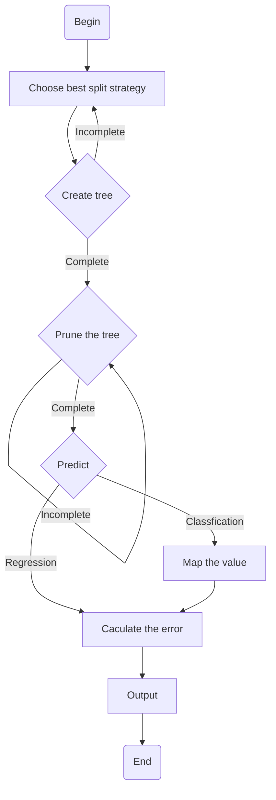

# CART

## 1. Questions
**The Classification and Regression of Red Wine Quality**.

Number | Feature | Explanation 
:-: | :-: | :-- 
1 | fixed acidity | most acids involved with wine or fixed or nonvolatile (do not evaporate readily)
2 | volatile acidity | the amount of acetic acid in wine, which at too high of levels can lead to an unpleasant, vinegar taste
3 | citric acid | found in small quantities, citric acid can add 'freshness' and flavor to wines
4 | residual sugar | the amount of sugar remaining after fermentation stops, it's rare to find wines with less than 1 gram/liter and wines with greater than 45 grams/liter are considered sweet
5 | chlorides | the amount of salt in the wine
6 | free sulfur dioxide | the free form of SO2 exists in equilibrium between molecular SO2 (as a dissolved gas) and bisulfite ion; it prevents microbial growth and the oxidation of wine
7 | total sulfur dioxide | amount of free and bound forms of S02; in low concentrations, SO2 is mostly undetectable in wine, but at free SO2 concentrations over 50 ppm, SO2 becomes evident in the nose and taste of wine
8 | density | the density of water is close to that of water depending on the percent alcohol and sugar content
9 | pH | describes how acidic or basic a wine is on a scale from 0 (very acidic) to 14 (very basic); most wines are between 3-4 on the pH scale
10 | sulphates | a wine additive which can contribute to sulfur dioxide gas (S02) levels, which acts as an antimicrobial and antioxidant 
11 | alcohol | the percent alcohol content of the wine
12 | quality | output variable (based on sensory data, score between 0 and 10)

We choose both questions in the dataset2, predict whether the result is above 6 (>6) or not and predict the result.

We report the accuracy and MSE.

## 2. Approaches that we thought about trying.
We have thought to try the normal binary decision tree.
However, after research, we found that the normal binary decision tree can just fit the variables of the discrete type.
Therefore, we give it up.
Then, we found that CART is based on the decision tree can solve the continuous type variables. 

## 3. The final approach

### Best split strategy and tree creation

CART is built by splitting the source set, constituting the root node of the tree, into subsets—which constitute the successor children. The splitting is based on Gini index which chooses the best feature to split. This process is repeated on each derived subset in a recursive manner called recursive partitioning. The recursion is completed when the subset at a node has all the same values of the target variable, or when splitting no longer adds value to the predictions. This process of top-down induction of decision trees (TDIDT) is an example of a greedy algorithm.

### Pruning

One of the questions that arises in CART algorithm is the optimal size of the final tree. A tree that is too large risks overfitting the training data and poorly generalizing to new samples. A small tree might not capture important structural information about the sample space. However, it is hard to tell when a tree algorithm should stop because it is impossible to tell if the addition of a single extra node will dramatically decrease error. This problem is known as the horizon effect. A common strategy is to grow the tree until each node contains a small number of instances then use pruning to remove nodes that do not provide additional information.

#### Pre-pruning

Modify tree generation conditions. When the leaf error estimation and branch size is small enough, stop creating the tree, generating a leaf that can describe this branch generally.

#### Post-pruning

Use another dataset to evaluate the CART tree. Calculate the degree of fit and the cost of pruning to collapse the branch.

## 4. Working principle and logic of the approach

## 5. Results

1. `Acurracy` = 86.7%
2. `MSE` = 0.546

## 6. Conclusions

In conclusion, the model created by CART is quite fine to predict the wine quality.

The model implies that alcohol is one of the most important features that decide the quality of the red wine. And every feature can influence the wine quality.
